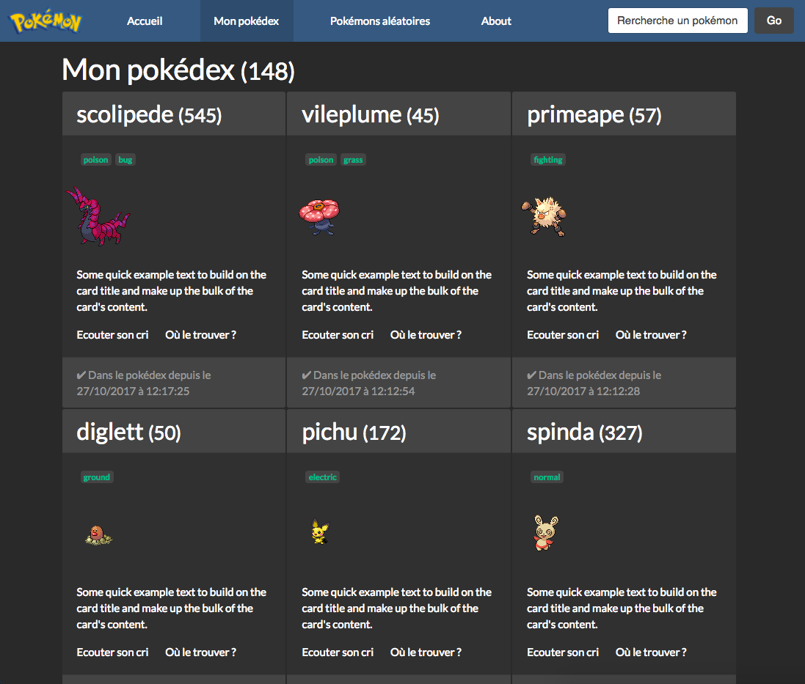

# pokedex-mean    
Pokédex réalisé lors d'un TP avec les technos MEAN (Mongo, Express, Angular 2 and Node.js)

## Getting Started
1. Clone the repository
2. Install the dependencies with `npm install`
3. Launch Angular Server with `ng serve` (port 4200)
4. Launch Express Node Js Server with `npm start` (port 3000)
5. Go on http://localhost:4200 to see project

## Liens utiles
- https://www.djamware.com/post/58cf4e1c80aca72df8d1cf7e/tutorial-building-crud-app-from-scratch-using-mean-stack-angular-2
- https://codecraft.tv/courses/angular/http/http-with-promises/
- https://getbootstrap.com/docs/4.0/getting-started/introduction/
- http://mongoosejs.com/docs/api.html#model_Model.findOne
- http://mongoosejs.com/docs/models.html
- https://www.youtube.com/watch?v=wtIvu085uU0

# Pokemon

This project was generated with [Angular CLI](https://github.com/angular/angular-cli) version 1.4.9.

## Development server

Run `ng serve` for a dev server. Navigate to `http://localhost:4200/`. The app will automatically reload if you change any of the source files.

## Code scaffolding

Run `ng generate component component-name` to generate a new component. You can also use `ng generate directive|pipe|service|class|guard|interface|enum|module`.

## Build

Run `ng build` to build the project. The build artifacts will be stored in the `dist/` directory. Use the `-prod` flag for a production build.

## Running unit tests

Run `ng test` to execute the unit tests via [Karma](https://karma-runner.github.io).

## Running end-to-end tests

Run `ng e2e` to execute the end-to-end tests via [Protractor](http://www.protractortest.org/).

## Further help

To get more help on the Angular CLI use `ng help` or go check out the [Angular CLI README](https://github.com/angular/angular-cli/blob/master/README.md).

